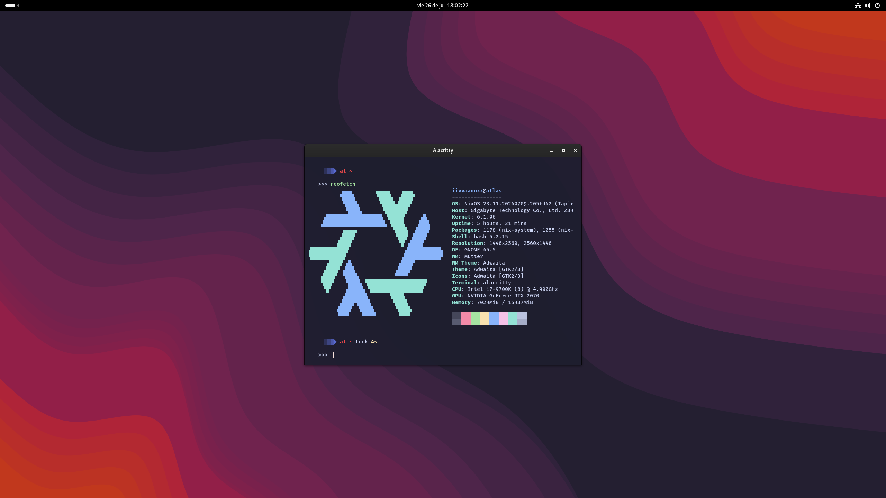

<div align="center">
  <h1>❄️ My NixOS Configurations</h1>
  
</div>

<p></p>

<div align="center">
  
  <p></p>
</div>

<p align="center">
  <a href="https://nixos.org/"></a>
  <a href="https://nix.dev/tutorials/nix-language"></a>
  <a href="https://alacritty.org/"></a>
  <a href="https://starship.rs/"></a>
  <a href="https://www.nvidia.com/en-us/"></a>
  <a href="https://flake.parts/"></a>
</p>

<p></p>

> [!IMPORTANT]
> This is a constant work in progress. I've been using NixOS for over a year now and am still a beginner. These dotfiles haven't been updated in a while, because the current configuration didn't need much more things to be added. But there's a lot more I want to customize and add to it, which I will be doing in the future.

> [!CAUTION]
> While you can use this as a reference, it's almost certain that you will need to make changes to fit your system. Check the [useful links](#-useful-links) section for more information on how to configure NixOS.

## Table of Contents

- [📖 Introduction](#-introduction)
  - [What is NixOS?](#what-is-nixos)
  - [Why I use NixOS?](#why-i-use-nixos)
  - [These Dotfiles](#these-dotfiles)
- [⚙️ Structure](#️-structure)
- [🖥️ Installation](#️-installation)
- [💡 Inspiration](#-inspiration)
- [🔗 Useful Links](#-useful-links)
- [🚀 Future Work](#-future-work)

## 📖 Introduction

### What is NixOS?

[NixOS](https://nixos.org/) is a Linux distribution that is configured using the Nix package manager. It's a very unique and powerful system, where the entire system configuration is written in a declarative way. This means that you can easily reproduce your system configuration in any machine, just by copying the configuration files. 

### Why I use NixOS?

***Because I like pain and suffering***. Besides that, NixOS is a very interesting and powerful operating system. I really like the idea of having a declarative configuration for my system, where I can easily reproduce it in any machine. It has a lot of packages and while it can be a bit hard to setup some of them, it's just very comfortable to have everything in "one" place (ironically enough, the entire configuration is split in multiple files).

### These Dotfiles

This configuration files use NixOS's [Flake](https://nixos.wiki/wiki/Flakes) system, which is a new way to manage Nix projects. They are tailored to my system and my needs, but you can use them as a reference to create your own configuration. To allow the use of these configurations in multiple systems, I am using [Flake Parts](https://flake.parts/) to manage the flake outputs more cleanly, and to ensure that the final configuration is fully validated (something that Flake Utils doesn't do).

## ⚙️ Structure

My intention when thinking how to structure these configurations was to make it as modular and automated as possible and also intuitive. While there's always room for improvement and the way I've done it might not be the best for everyone, I think it's pretty comfortable to use.

|  | Section | Description |
|:-:|---------|-------------|
| 🧩 | configs | Stores reusable pieces of configurations, like common networking options, localization settings, or general system configurations. |
| 🖥️ | hosts | Contains the configurations for each machine. Currently only one (public) machine is configured. Each host must be contained in a folder with the same name as the host. This folder must contain a `default.nix` file, which will be the entry point for the **system** configuration (what would be the global `configuration.nix` file located at `etc/nixos`). You can then split the configuration in multiple files as I did in my `atlas` host, and then leverage the powerful module system to include them in the `default.nix` file via the `imports` option. |
| 🛠️ | lib | Contains custom functions and utilities that are automatically feeded to the `flake` when building any configuration. Each function included there is available via the `lib.custom` attribute. You can always add more functions to this folder, but remember to update the `default.nix` file to ensure they are available under the `lib.custom` attribute. |
| 📦 | modules | I recommend checking the docs on how to write modules in the [NixOS Wiki](https://wiki.nixos.org/wiki/NixOS_modules) to understand how to write your own modules. This folder includes the code for all the custom modules you want to implement. Modules are just a way to abstract a set of options under another interface. They are useful to make the configurations more readable and contain the configuration logic for a specific module in one place. The modules are classified in two types: `nixos` and `home-manager`. <br /> <br /> The `nixos` modules are used to configure the system itself, while the `home-manager` modules are used to configure the user's environment. All the modules are automatically loaded and available to use within the flake if they are present in either the `nixos/default.nix` module array or the `home-manager/default.nix` module array. |
| 🔧 | overlays | See the [wiki](https://wiki.nixos.org/wiki/Overlays) for more information. The overlays aren't still fully integrated into this flake configuration, and as of this moment the only overlay that I have is the one I used to extend the `lib` attribute with custom functions. |
| 📚 | packages | Custom packages built by you/me. This is the place to store packages that you want to use in your system, but that aren't available in the official NixOS repositories. Every package you define under this folder will be automatically picked and installed in your system. |
| 🗂️  | presets | This folder is similar to the `modules` one, as it also classified by two types, `nixos` and `home-manager`. The purpose of this folder is to define pre-made and ready to use module configurations. Then include them via the module system wherever you want. This way you can make and store multiple configurations for a single module and swap/use them as you prefer. |
| 📋 | templates | Just like the `overlays`, these are not integrated yet to the flake. But the purpose of this folder is to define [nix flake templates](https://nix.dev/manual/nix/2.22/command-ref/new-cli/nix3-flake-init) that you could later use via `nix flake init`.  |
| 👥 | users | Here are stored the individual configurations for the different users you may want to have. Each of them is defined separately, in its own folder, much like the `hosts`. Each user folder must define at least two files, which are `default.nix` and `profile.nix`. The `profile.nix` is used as a separated "constants" file. You may add here any data you want, but at least the `name` and the `username` of the user are required, as these get automatically feeded to the configuration for the selected host when building. The `default.nix` file is just the `home-manager` configuration file for that user, and it receives the entire `profile` attribute set as an argument.  |

## 🖥️ Installation

As it's stated in the top of this README, these configurations are tailored to my system and my needs. You can use them as a reference to create your own configuration, but you will need to make changes to fit your system. This is a very basic and general guide on how to install NixOS, it does not cover things like setting up the network, installing necessary packages or setting up the partition scheme, you may need to check the [official manual](https://nixos.org/manual/nixos/stable/index.html) for more detailed instructions.

1. Boot into the installer from any medium (USB, CD...). You can get the latest NixOS ISO from the [official website](https://nixos.org/download.html).

2. Switch to the root user via `sudo su -`. Then create your partitions. You can use [this file](./hosts/atlas/filesystem.nix) from my `atlas` host as reference. Any changes you make to the partitioning scheme must be reflected in the configuration of the host you are setting up. Do it the way you prefer, I find `cfdisk` to be very useful. You can make these changes after you clone the repository on step 4.

3. Format the partitions using the `mkfs` utility commands. Then mount the partitions and `cd` into the mounted root partition. 

4. Then run `nix-shell -p git nixFlakes` to enter a shell with the necessary tools to clone the repository and build the system. Install NixOS using the following command and you're good to go:

```sh
cd /the-repo/path/with/the/flake.nix

# The hostname must be a valid output of the flake under `nixosConfigurations`.
nixos-install --flake .#<hostname-without-brackets> 
```
## 💡 Inspiration

Here are some of the repositories I based my configurations on:

- https://github.com/rxyhn/yuki/tree/main
- https://github.com/Misterio77/nix-config
- https://github.com/ryan4yin/nix-config/tree/main (great for beginners).
- https://github.com/gvolpe/nix-config
- https://github.com/mitchellh/nixos-config


## 🔗 Useful Links

These links are very useful to understand how NixOS works and how to configure it:

- [NixOS Manual](https://nixos.org/manual/nixos/stable/index.html)
- [NixOS Wiki (Unofficial)](https://nixos.wiki/)
- [NixOS Wiki (Official)](https://wiki.nixos.org/)
- [Nix Flakes](https://nixos.wiki/wiki/Flakes)
- [Nix Pills](https://nixos.org/guides/nix-pills/)
- [Nix Language Tutorial](https://nix.dev/tutorials/nix-language)
- [NixOS & Flakes Book](https://nixos-and-flakes.thiscute.world/nixos-with-flakes/introduction-to-flakes)
- [Package and Option Search](https://search.nixos.org/)
- [Home Manager Option Search](https://home-manager-options.extranix.com/)

## 🚀 Future Work

- [ ] Manage secrets with [sops-nix](https://github.com/Mic92/sops-nix) or [agenix](https://github.com/ryantm/agenix).
- [ ] Finish setup of [Cachix](https://cachix.org) binary cache. Or maybe switch to a [self-hosted](https://github.com/zhaofengli/attic) one.
- [ ] Configurations for full remote access with [OpenVPN](https://openvpn.net/)/[Wireguard](https://www.wireguard.com/) (requires secrets set-up).
- [ ] Further system customization and flake improvements.


